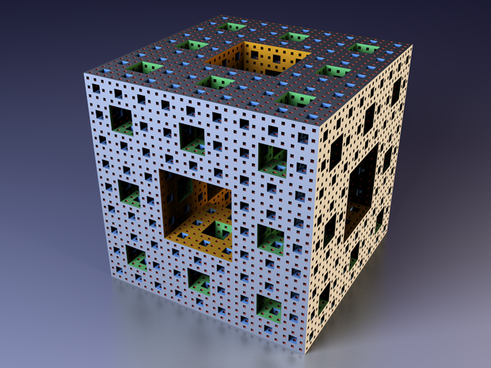

# 0x05. Menger sponge

## Welcome
<p align="center"></p>

A [Menger sponge](https://en.wikipedia.org/wiki/Menger_sponge) is a fractal curve. It is a three-dimensional generalization of the one-dimensional Cantor set and two-dimensional Sierpinski carpet.

## Algorithm
The code creates a simple, ascii-based 2D Sierpinski carpet to the screen.

## Table of Contents
* [Requirements](#requirements)
* [Installation](#installation)
* [Usage](#usage)

## Requirements
* Ubuntu 14.04 LTS
* gcc 4.8.4 (-Wall, -Werror, -Wextra, and -pedantic flags)
* Betty, C linter

## Installation
In your terminal, git clone the directory with the following command:
```
git clone https://github.com/feliciahsieh/holbertonschool-interview_prep
cd 0x05-menger
```

Compile the files using:

```
gcc -Wall -Wextra -Werror -pedantic -o 0-menger -g 0-menger.c 0-main.c -lm
```

## Usage

Run the program using

```
./0-menger
```
