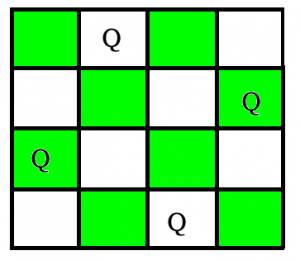

# 0x0A. N Queens

<p align="center"></p>

## Welcome
Find N non-attacking Queens chess piece that can be placed on an N×N chessboard. The solution should use backtracking.

## Algorithm

* 

## Table of Contents
* [Requirements](#requirements)
* [Installation](#installation)
* [Usage](#usage)

## Requirements
* Ubuntu 14.04 LTS
* python 3.4.3
* pycodestyle, python linter

## Installation
In your terminal, git clone the directory with the following command:
```
git clone https://github.com/feliciahsieh/holbertonschool-interview_prep
cd 0x0A-nqueens
```

## Usage

Run the program using

```
./0-nqueens.py [number]

where [number] is an integer >= 4
```
