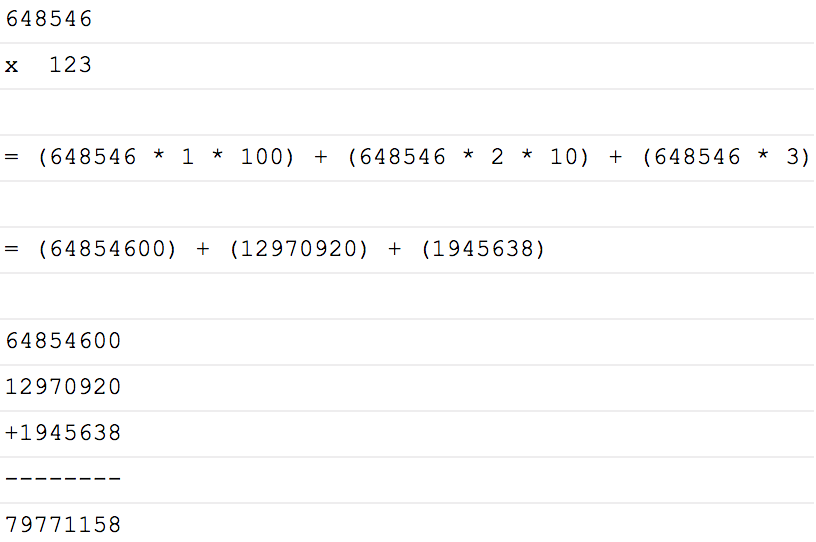

# 0x0E. Infinite Multiplication

<p align="center"></p>

## Welcome


## Algorithm

* 

## Table of Contents
* [Requirements](#requirements)
* [Installation](#installation)
* [Usage](#usage)

## Requirements
* Ubuntu 14.04 LTS
* gcc 4.8.4 (-Wall, -Werror, -Wextra, and -pedantic flags)
* Betty, C linter

## Installation
In your terminal, git clone the directory with the following command:
```
git clone https://github.com/feliciahsieh/holbertonschool-interview_prep
cd 0x0E-infinite_multiplication
```

Compile the files using:

```
gcc -Wall -pedantic -Werror -Wextra 0-mul.c _putchar.c -o mul
```

## Usage

Run the program using

```
./mul [num1] [num2]
```
